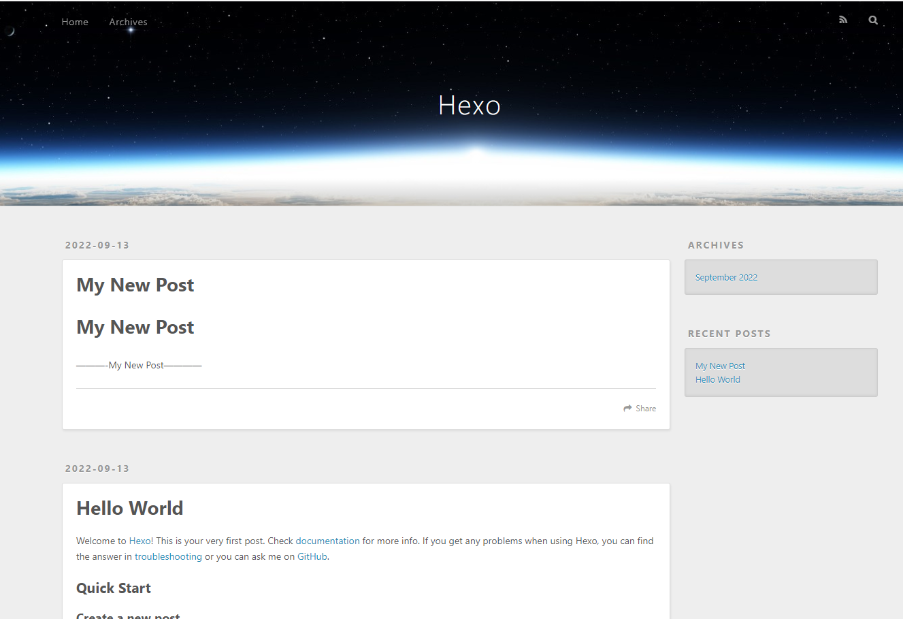

# hexo-blog

## 介绍

hexo 博客项目。

[hexo 官网](https://hexo.io/zh-cn/)，[hexo 文档](https://hexo.io/zh-cn/docs/)，[hexo 部署到 GitHub](https://hexo.io/zh-cn/docs/github-pages)，[hexo 源码](https://github.com/hexojs/hexo)，[hexo-starter](https://github.com/hexojs/hexo-starter)。

## 安装教程

### 1. 安装 hexo-cli

```
npm install hexo-cli -g
```

### 2. 初始化项目

```
hexo init hexo-blog
cd hexo-blog
npm install
hexo server
```

### 3. 将项目托管到 GitHub

#### 3.1 在 GitHub 上创建 hexo-blog 仓库

#### 3.2 将项目推送到 GitHub

```
git init
git add .
git remote add origin https://github.com/d7c-admin/hexo-blog.git
git branch -m master main
git pull --rebase origin main
手动解决 .gitignore 文件冲突。
git commit -m "first commit"
git push -u origin main
```

### 4. 部署站点

#### 4.1 安装 hexo-deployer-git

```
npm install --save hexo-deployer-git
```

#### 4.2 创建文章

```
hexo new "My New Post"
```

#### 4.3 生成静态文件

```
hexo clean
hexo generate
```

#### 4.4 部署到站点

```
hexo deploy
```

## 目录说明

```
|-- hexo-blog
    |-- .github
    |-- docs
    |-- node_modules
    |-- scaffolds（模板目录）
    |-- source（资源目录）
        |-- _posts（文章目录）
    |-- themes（主题目录）
    |-- .gitignore
    |-- _config.landscape.yml
    |-- _config.yml（网站配置信息）
    |-- db.json
    |-- package.json
```

## 使用说明

### 1. 克隆并安装项目，在项目根目录下执行

```
npm install
```

### 2. 启动命令

```
hexo server
```

## 运行展示



<style>p{text-indent:2em}</style>
